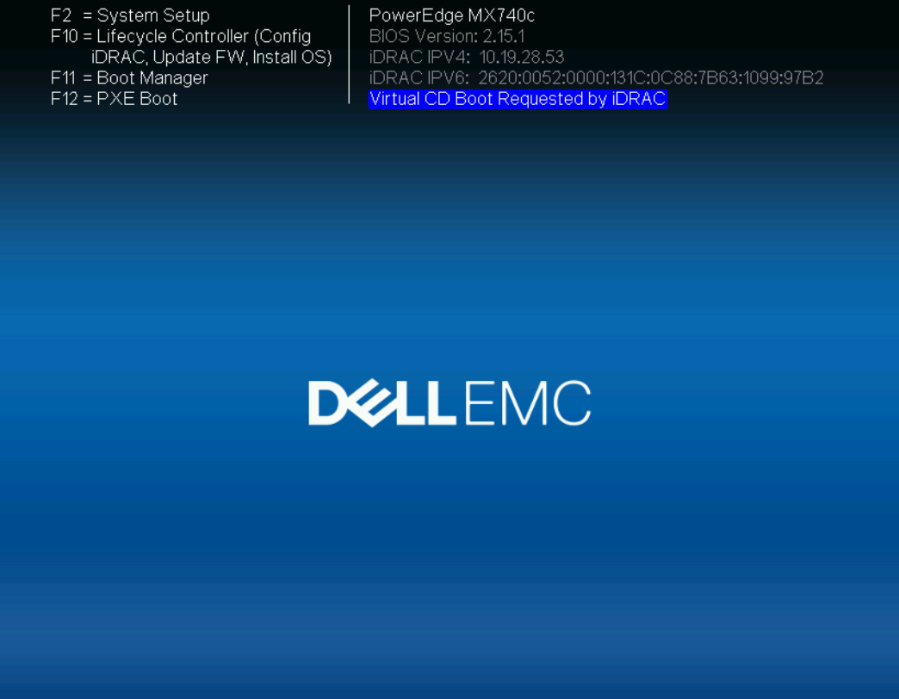

# Factory-cli: Booting from a live OS #

## Background ##

We want to focus on target servers where only one disk is available and no external disk drive is possible to be attached. Assisted installer, which is part of the ZTP flow, leverages the coreos-installer utility to write RHCOS to disk. This means that if we boot from a pre-installed RHCOS on a single disk, the utility will complain because the device is in use and cannot finish the process of writing. Then, the only way we have to run the full pre-caching process is by booting from a live ISO and using the factory-cli tool from a container image to partition and pre-cache all the artifacts required.

:warning: RHCOS requires the disk to not be in use when is about to be written by an RHCOS image. Reinstalling onto the current boot disk is an unusual requirement, and the coreos-installer utility wasn't designed for it.

## Boot from RHCOS live

Technically you can boot from any live ISO that provides container tools such as podman. However, the supported and tested OS is Red Hat CoreOS. You can obtain the latest live ISO from [here](https://mirror.openshift.com/pub/openshift-v4/x86_64/dependencies/rhcos/latest/rhcos-live.x86_64.iso)

### Example: Mounting on a Dell Server
If you are running the install on a Dell Server you can use this simple script that leverages racadm to mount RHCOS live ISO from a local HTTPd server.

```
#/bin/bash

CONTAINER_TOOL=podman
IDRAC_IP=$1

${CONTAINER_TOOL} run --network host --rm -it quay.io/alosadag/racadm:latest -r $IDRAC_IP -u root -p $PASSWD- remoteimage -d
${CONTAINER_TOOL} run --network host --rm -it quay.io/alosadag/racadm:latest -r $IDRAC_IP -u root -p $PASSWD- remoteimage -c -l http://10.19.138.94/rhcos-4.10.16-x86_64-live.x86_64.iso
${CONTAINER_TOOL} run --network host --rm -it quay.io/alosadag/racadm:latest -r $IDRAC_IP -u root -p $PASSWD- set iDRAC.VirtualMedia.BootOnce 1
${CONTAINER_TOOL} run --network host --rm -it quay.io/alosadag/racadm:latest -r $IDRAC_IP -u root -p $PASSWD- set iDRAC.ServerBoot.FirstBootDevice VCD-DVD
${CONTAINER_TOOL} run --network host --rm -it quay.io/alosadag/racadm:latest -r $IDRAC_IP -u root -p $PASSWD- serveraction powercycle
```

Then run the script:

```
./rhcos-live-racadm.sh 10.19.28.53
Security Alert: Certificate is invalid - self signed certificate
Continuing execution. Use -S option for racadm to stop execution on certificate-related errors.
Disable Remote File Started. Please check status using -s                    
option to know Remote File Share is ENABLED or DISABLED.

Security Alert: Certificate is invalid - self signed certificate
Continuing execution. Use -S option for racadm to stop execution on certificate-related errors.
Remote Image is now Configured                                               

Security Alert: Certificate is invalid - self signed certificate
Continuing execution. Use -S option for racadm to stop execution on certificate-related errors.
[Key=iDRAC.Embedded.1#VirtualMedia.1]                                        
Object value modified successfully

Security Alert: Certificate is invalid - self signed certificate
Continuing execution. Use -S option for racadm to stop execution on certificate-related errors.
[Key=iDRAC.Embedded.1#ServerBoot.1]                                          
Object value modified successfully

Security Alert: Certificate is invalid - self signed certificate
Continuing execution. Use -S option for racadm to stop execution on certificate-related errors.
Server power operation initiated successfully                        
```

>:warning: If you are targetting an HP server you can also use their own administration tools to manage HP iLOs.

You can also interact directly with the redfish interface, in case there is one available:

```
//Media Status
curl --globoff -H "Content-Type: application/json" -H "Accept: application/json" -k -X GET --user ${username_password} https://$BMC_ADDRESS/redfish/v1/Managers/Self/VirtualMedia/1 | python -m json.tool

//Insert Media. Please use your http server and iso file
curl --globoff -L -w "%{http_code} %{url_effective}\\n" -ku ${username_password} -H "Content-Type: application/json" -H "Accept: application/json" -d '{"Image": "http://[$HTTPd_IP]/RHCOS-live.iso"}' -X POST https://$BMC_ADDRESS/redfish/v1/Managers/Self/VirtualMedia/1/Actions/VirtualMedia.InsertMedia

// Set boot order
curl --globoff  -L -w "%{http_code} %{url_effective}\\n"  -ku ${username_password}  -H "Content-Type: application/json" -H "Accept: application/json" -d '{"Boot":{ "BootSourceOverrideEnabled": "Once", "BootSourceOverrideTarget": "Cd", "BootSourceOverrideMode": "UEFI"}}' -X PATCH https://$BMC_ADDRESS/redfish/v1/Systems/Self
```

Then reboot the server and make sure it is booting from virtual media.





## Interacting with RHCOS live

Once you have mounted the live ISO using the IPMI interface and booted from virtual media you can connect to the virtual console of your target server.  You should see that you are already logged into the system as the `core` user. In order to make your life easier for setting up the next stage: [partitioning](../partitioning.md) we suggest permitting login via SSH:

* Execute sudo to root
* Modify the /etc/ssh/sshd_config by allowing accessing using a password (PasswordAuthentication yes) and root as user (PermitRootLogin yes).
* Reload the sshd systemd service
* Change root password


At this point you should be able to SSH to the server and continue with the [partitioning](../partitioning.md) stage.