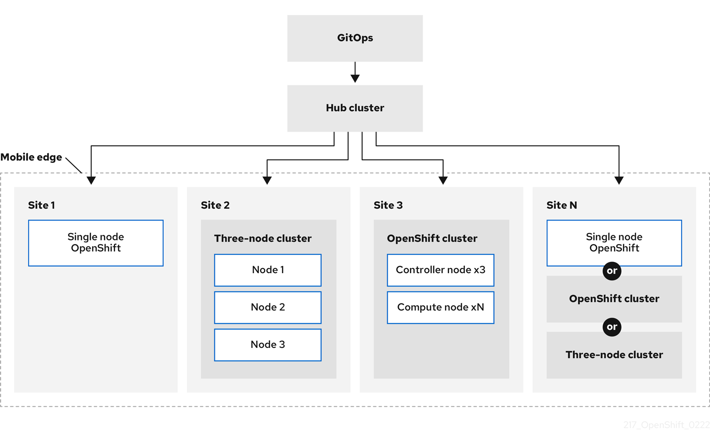
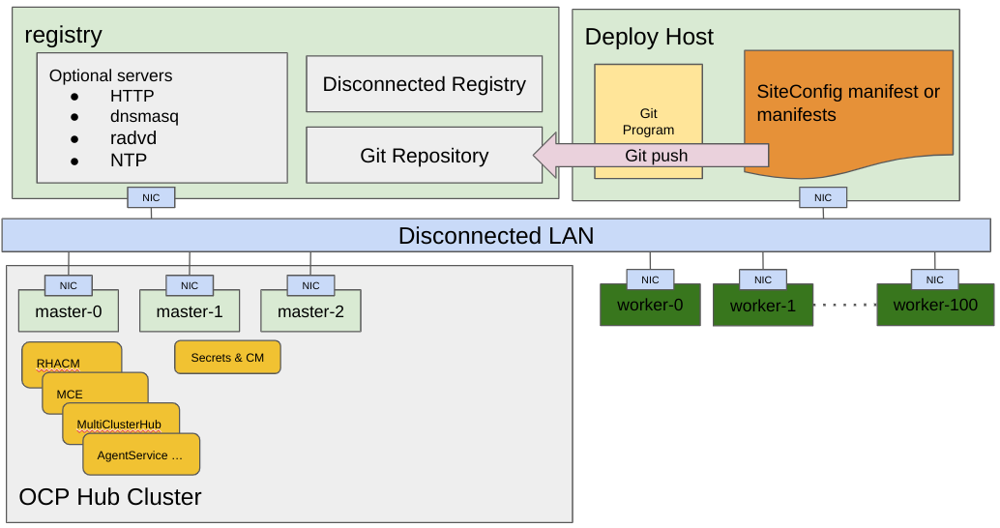
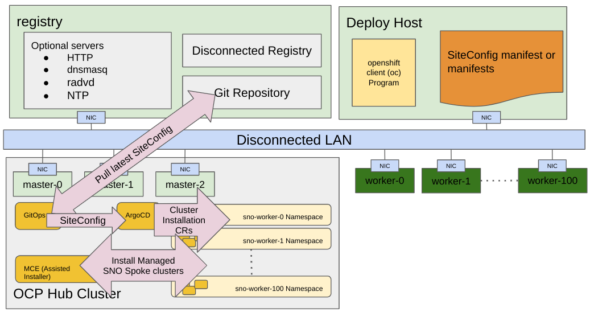
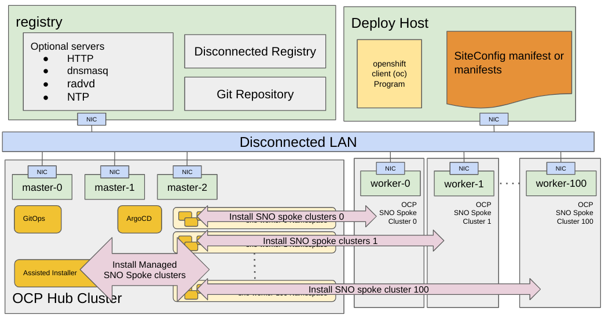
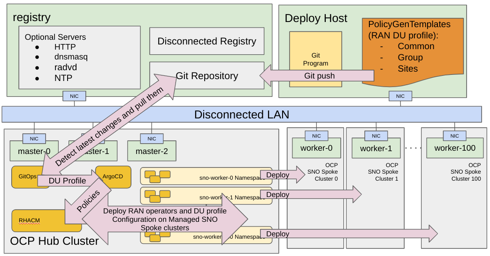

# Factory-cli: Zero Touch Provisioning configuration

<!-- vscode-markdown-toc -->

* 1. [Zero Touch Provisioning (ZTP)](#ZeroTouchProvisioningZTP)
* 2. [ZTP workflow](#ZTPworkflow)
* 3. [Pre-requisites](#Pre-requisites)
* 4. [Preparing the siteconfig](#Preparingthesiteconfig)
	* 4.1. [clusters.ignitionConfigOverride](#clusters.ignitionConfigOverride)
	* 4.2. [nodes.installerArgs](#nodes.installerArgs)
	* 4.3. [nodes.ignitionConfigOverride](#nodes.ignitionConfigOverride)
* 5. [Start ZTP](#StartZTP)

<!-- vscode-markdown-toc-config
	numbering=true
	autoSave=true
	/vscode-markdown-toc-config -->
<!-- /vscode-markdown-toc -->

>:exclamation: The factory-cli tool permits to download a rootfs image to the local partition. Therefore, when booting the discovery ISO we can use a lightweight image and pull the rootfs from a local partition or from a local HTTPd server. Currently ZTP does not allow a declarative and automated way to load the rootfs image from a local partition.

##  1. <a name='ZeroTouchProvisioningZTP'></a>Zero Touch Provisioning (ZTP)

Edge computing presents extraordinary challenges with managing hundreds to tens of thousands of clusters in hundreds of thousands of locations. These challenges require fully-automated management solutions with, as closely as possible, zero human interaction.

*Zero touch provisioning (ZTP)* allows you to provision new edge sites with declarative configurations of bare-metal equipment at remote sites following a GitOps deployment set of practices. All configurations are declarative in nature.

ZTP is a project to deploy and deliver OpenShift 4 in a hub-and-spoke architecture (in a relation of 1-N), where a single hub cluster manages many spoke clusters. The hub and the spokes will be based on OpenShift 4 but with the difference that the hub cluster will manage, deploy and control the lifecycle of the spokes using Red Hat Advanced Cluster Management (RHACM). So, hub clusters running RHACM apply radio access network (RAN) policies from predefined custom resources (CRs) and provision and deploy the spoke clusters using multiple products. 

>:exclamation: ZTP can have two scenarios, connected and disconnected, whether the OpenShift Container Platform Worker nodes can directly access the internet or not. In telco deployments, the disconnected scenario is the most common.

ZTP provides support for deploying single node clusters, three-node clusters, and standard OpenShift clusters. This includes the installation of OpenShift and deployment of the distributed units (DUs) at scale. However, the factory-cli tool focuses on SNO clusters only.



##  2. <a name='ZTPworkflow'></a>ZTP workflow

Zero Touch Provisioning (ZTP) leverages multiple products or components to deploy OpenShift Container Platform clusters using a GitOps approach. While the workflow starts when the site is connected to the network and ends with the CNF workload deployed and running on the site nodes, it can be logically divided into two different stages: provisioning of the SNO and applying the desired configuration, which in our case is applying the validated RAN DU profile.

> :warning: The workflow does not need any intervention, so ZTP automatically will configure the SNO once it is provisioned. However, two stages are clearly differentiated.

The workflow is officially started by creating declarative configurations for the provisioning of your OpenShift clusters. This manifest is described in a custom resource called `siteConfig`. See that in a disconnected environment, there is a need for a container registry which has been configured to deliver the required OpenShift container images required for the installation. This task can be achieved by using [oc-mirror])https://docs.openshift.com/container-platform/latest/installing/disconnected_install/installing-mirroring-disconnected.html).

>:exclamation: The factory-cli-tool tries to limit the usage of a container registry to pull down the required images. Currently, a registry is still needed since a couple of components require checking the availability of certain images to continue with the installation. The end goal is avoiding this requirement.

Depending on your specific environment, you might need a couple of extra services such as DHCP, DNS, NTP or HTTP. The latest will be needed for downloading the RHCOS live ISO and the rootfs image locally instead of the default [OpenShift mirror webpage](http://mirror.openshift.com.)

Once the configuration is created you can push it to the Git repo where Argo CD is continuously looking to pull the new content:



Argo CD pulls the siteConfig and uses a specific kustomize plugin called [siteconfig-generator](https://github.com/openshift-kni/cnf-features-deploy/tree/master/ztp/siteconfig-generator-kustomize-plugin) to transform it into custom resources that are understood by the hub cluster (RHACM/MCE). A siteConfig contains all the necessary information to provision your node or nodes. Basically, it will create ISO images with the defined configuration that are delivered to the edge nodes to begin the installation process. The images are used to repeatedly provision large numbers of nodes efficiently and quickly, allowing you to keep up with requirements from the field for far-edge nodes. 

> :warning: On telco use cases, clusters are mainly running on bare-metal hosts. Therefore the produced ISO images are mounted using remote virtual media features of the baseboard management controller (BMC).

In the picture, these resulting manifests are called Cluster Installation CRs. Finally, the provisioning process starts.



The provisioning process includes installing the host operating system (RHCOS) on a blank server and deploying OpenShift Container Platform. This stage is managed mainly by a ZTP component called the Infrastructure Operator

> :exclamation: Notice, in the picture, how ZTP allows us to provision clusters at scale.



Once the clusters are provisioned, the day-2 configuration defined in multiple `PolicyGenTemplate` (PGTs) custom resources will be automatically applied. `PolicyGenTemplate` custom resource is understood by the ZTP using a specific kustomize plugin called [policy-generator](https://github.com/openshift-kni/cnf-features-deploy/tree/master/ztp/policygenerator-kustomize-plugin). In telco RAN DU nodes, this configuration includes the installation of the common telco operators, a common configuration for RAN and specific configuration (SR-IOV or performance settings) for each site since it is very dependant on the hardware.



Notice that if, later on, you want to apply a new configuration or replace an existing configuration you must use a new `policyGenTemplate` to do that.


##  3. <a name='Pre-requisites'></a>Pre-requisites

* The [partitioning stage](./partitioning.md) was already executed successfully.
* The [downloading stage](./downloading.md) is completed, so all dependent artifacts are already stored on the disk partition.
* The bare metal server is powered off.

##  4. <a name='Preparingthesiteconfig'></a>Preparing the siteconfig

As mentioned, a `siteConfig` manifest defines in a declarative manner how an OpenShift target cluster is going to be installed and configured. Below it is an example of a valid siteConfig, however, unlike the regular ZTP provisioning workflow 3 extra fields need to be included:

* **clusters.ignitionConfigOverride**. This field adds an extra configuration in ignition format during the ZTP discovery stage. Basically, it includes a couple of systemd services in the ISO that it is mounted using virtual media. This way, those scripts are part of the RHCOS discovery live ISO and can be used at that point to load the Assisted Installer images.
* **nodes.installerArgs**. This field allows us to configure the way coreos-installer utility writes the RHCOS live ISO to disk. In this case, we need to indicate to save the disk partition labeled as 'data'. The artifacts saved there will be needed during the OCP installation stage.
* **nodes.ignitionConfigOverride**. This field adds similar functionality as the clusters.ignitionConfigOverride, but in the OCP installation stage. Notice that once the RHCOS is written to disk, the extra configuration included in the ZTP discovery ISO is not there anymore. It was in memory since we were running a live OS during the discovery stage. This field allows the addtion of extra configuration in ignition format to the coreos-installer binary, which is in charge of writing the RHCOS live OS to disk.

> :exclamation: You can just copy and paste the three fields described above in your siteConfig. A detailed explanation of each one is included in the following sections.

```yaml
apiVersion: ran.openshift.io/v1
kind: SiteConfig
metadata:
  name: "clus3a-5g-lab"
  namespace: "clus3a-5g-lab"
spec:
  baseDomain: "e2e.bos.redhat.com"
  pullSecretRef:
    name: "assisted-deployment-pull-secret"
  clusterImageSetNameRef: "img4.9.10-x86-64-appsub"
  sshPublicKey: "ssh-rsa ..."
  clusters:
  - clusterName: "sno-worker-0"
    clusterImageSetNameRef: "eko4-img4.11.5-x86-64-appsub"
    clusterLabels:
      group-du-sno: ""
      common-411: true
      sites : "clus3a-5g-lab"
      vendor: "OpenShift"
    clusterNetwork:
      - cidr: 10.128.0.0/14
        hostPrefix: 23
    machineNetwork:
      - cidr: 10.19.32.192/26
    serviceNetwork:
      - 172.30.0.0/16
    networkType: "OVNKubernetes"
    additionalNTPSources:
      - clock.corp.redhat.com
    ignitionConfigOverride: '{"ignition":{"version":"3.1.0"},"systemd":{"units":[{"name":"var-mnt.mount","enabled":true,"contents":"[Unit]\nDescription=Mount partition with artifacts\nBefore=precache-images.service\nBindsTo=precache-images.service\nStopWhenUnneeded=true\n\n[Mount]\nWhat=/dev/disk/by-partlabel/data\nWhere=/var/mnt\nType=xfs\nTimeoutSec=30\n\n[Install]\nRequiredBy=precache-images.service"},{"name":"precache-images.service","enabled":true,"contents":"[Unit]\nDescription=Extracts the precached images in discovery stage\nAfter=var-mnt.mount\nBefore=agent.service\n\n[Service]\nType=oneshot\nUser=root\nWorkingDirectory=/var/mnt\nExecStart=bash /usr/local/bin/extract-ai.sh\n#TimeoutStopSec=30\n\n[Install]\nWantedBy=multi-user.target default.target\nWantedBy=agent.service"}]},"storage":{"files":[{"overwrite":true,"path":"/usr/local/bin/extract-ai.sh","mode":755,"user":{"name":"root"},"contents":{"source":"data:,%23%21%2Fbin%2Fbash%0A%0AFOLDER%3D%22%24%7BFOLDER%3A-%24%28pwd%29%7D%22%0AOCP_RELEASE_LIST%3D%22%24%7BOCP_RELEASE_LIST%3A-ai-images.txt%7D%22%0ABINARY_FOLDER%3D%2Fvar%2Fmnt%0A%0Apushd%20%24FOLDER%0A%0Aload_images%28%29%20%7B%0A%0A%20%20declare%20-A%20pids%20%23%20Hash%20that%20include%20the%20images%20pulled%20along%20with%20their%20pids%20to%20be%20monitored%20by%20wait%20command%0A%20%20local%20max_bg%3D10%20%23%20Max%20number%20of%20simultaneous%20skopeo%20copies%20to%20container%20storage%0A%20%20local%20total_copies%3D%24%28sort%20-u%20%24BINARY_FOLDER%2F%24OCP_RELEASE_LIST%20%7C%20wc%20-l%29%20%20%23%20Required%20to%20keep%20track%20of%20the%20pull%20task%20vs%20total%0A%20%20local%20current_copy%3D1%0A%0A%20%20%23remove%20duplicates%0A%20%20sort%20-u%20-o%20%24OCP_RELEASE_LIST%20%24OCP_RELEASE_LIST%0A%0A%20%20while%20read%20-r%20line%3B%0A%20%20do%0A%20%20%20%20uri%3D%24%28echo%20%22%24line%22%20%7C%20awk%20%27%7Bprint%241%7D%27%29%0A%20%20%20%20podman%20image%20exists%20%24uri%0A%20%20%20%20if%20%5B%5B%20%24%3F%20-eq%200%20%5D%5D%3B%20then%0A%20%20%20%20%20%20echo%20%22%5BINFO%5D%20Skipping%20existing%20image%20%24tar%22%0A%20%20%20%20%20%20echo%20%22%5BINFO%5D%20Copying%20%24%7Buri%7D%20%5B%24%7Bcurrent_copy%7D%2F%24%7Btotal_copies%7D%5D%22%0A%20%20%20%20%20%20current_copy%3D%24%28%28current_copy%20%2B%201%29%29%0A%20%20%20%20%20%20continue%0A%20%20%20%20fi%0A%20%20%20%20tar%3D%24%28basename%20%24%7Buri%2F%3A%2F_%7D%29%0A%20%20%20%20tar%20--use-compress-program%3Dpigz%20-xf%20%24%7Btar%7D.tgz%0A%20%20%20%20if%20%5B%20%24%3F%20-ne%200%20%5D%3B%20then%0A%20%20%20%20%20%20echo%20%22%5BERROR%5D%20Could%20not%20extract%20the%20image%20%24%7Btar%7D.gz.%20Moving%20to%20next%20image%22%20%0A%20%20%20%20%20%20failed_copies%2B%3D%28%24%7Btar%7D%29%20%23%20Failed%2C%20then%20add%20the%20image%20to%20be%20retrieved%20later%0A%20%20%20%20%20%20current_copy%3D%24%28%28current_copy%20%2B%201%29%29%0A%20%20%20%20%20%20continue%0A%20%20%20%20fi%0A%20%20%20%20echo%20%22%5BINFO%5D%20Copying%20%24%7Buri%7D%20%5B%24%7Bcurrent_copy%7D%2F%24%7Btotal_copies%7D%5D%22%0A%20%20%20%20skopeo%20copy%20dir%3A%2F%2F%24%28pwd%29%2F%24%7Btar%7D%20containers-storage%3A%24%7Buri%7D%20-q%20%26%0A%0A%20%20%20%20pids%5B%24%7Buri%7D%5D%3D%24%21%20%23%20Keeping%20track%20of%20the%20PID%20and%20container%20image%20in%20case%20the%20pull%20fails%0A%20%20%20%20max_bg%3D%24%28%28max_bg%20-%201%29%29%20%23%20Batch%20size%20adapted%20%0A%20%20%20%20current_copy%3D%24%28%28current_copy%20%2B%201%29%29%0A%20%20%20%20if%20%5B%5B%20%24max_bg%20-eq%200%20%5D%5D%20%7C%7C%20%5B%5B%20%24current_copy%20-gt%20%24total_copies%20%5D%5D%20%23%20If%20the%20batch%20is%20done%2C%20then%20monitor%20the%20status%20of%20all%20pulls%20before%20moving%20to%20the%20next%20batch.%20If%20the%20last%20images%20are%20being%20pulled%20wait%20too.%0A%20%20%20%20then%0A%20%20%20%20%20%20for%20img%20in%20%24%7B%21pids%5B%40%5D%7D%3B%20do%0A%20%20%20%20%20%20%20%20wait%20%24%7Bpids%5B%24img%5D%7D%20%23%20The%20way%20wait%20monitor%20for%20each%20background%20task%20%28PID%29.%20If%20any%20error%20then%20copy%20the%20image%20in%20the%20failed%20array%20so%20it%20can%20be%20retried%20later%0A%20%20%20%20%20%20%20%20if%20%5B%5B%20%24%3F%20%21%3D%200%20%5D%5D%3B%20then%0A%20%20%20%20%20%20%20%20%20%20echo%20%22%5BERROR%5D%20Pull%20failed%20for%20container%20image%3A%20%24%7Bimg%7D%20.%20Retrying%20later...%20%22%0A%20%20%20%20%20%20%20%20%20%20failed_copies%2B%3D%28%24%7Bimg%7D%29%20%23%20Failed%2C%20then%20add%20the%20image%20to%20be%20retrieved%20later%0A%20%20%20%20%20%20%20%20else%0A%20%20%20%20%20%20%20%20%20%20echo%20%22%5BINFO%5D%20Removing%20folder%20for%20%24%7Bimg%7D%22%0A%20%20%20%20%20%20%20%20%20%20img_folder%3D%24%28basename%20%24%7Bimg%2F%3A%2F_%7D%29%0A%20%20%20%20%20%20%20%20%20%20rm%20-rf%20%24%7Bimg_folder%7D%0A%20%20%20%20%20%20%20%20fi%0A%20%20%20%20%20%20done%0A%20%20%20%20%20%20%23%20Once%20the%20batch%20is%20processed%2C%20reset%20the%20new%20batch%20size%20and%20clear%20the%20processes%20hash%20for%20the%20next%20one%0A%20%20%20%20%20%20max_bg%3D10%0A%20%20%20%20%20%20pids%3D%28%29%0A%20%20%20%20fi%0A%20%20done%20%3C%20%24%7BBINARY_FOLDER%7D%2F%24%7BOCP_RELEASE_LIST%7D%0A%7D%0A%0Aretry_images%28%29%20%7B%0A%20%20echo%20%22%5BRETRYING%5D%22%0A%20%20echo%20%22%22%0A%20%20local%20rv%3D0%0A%20%20for%20failed_copy%20in%20%24%7Bfailed_copies%5B%40%5D%7D%3B%20do%0A%20%20%20%20echo%20%22%5BRETRY%5D%20Retrying%20failed%20image%20pull%3A%20%24%7Bfailed_copy%7D%22%0A%20%20%20%20tar%3D%24%28basename%20%24%7Bfailed_copy%2F%3A%2F_%7D%29%0A%20%20%20%20tar%20--use-compress-program%3Dpigz%20-xf%20%24%7Btar%7D.tgz%0A%20%20%20%20if%20%5B%20%24%3F%20-ne%200%20%5D%3B%20then%0A%20%20%20%20%20%20echo%20%22%5BRETRY%20ERROR%5D%20Could%20not%20extract%20the%20image%20%24%7Btar%7D.gz.%20Moving%20to%20next%20image%22%0A%20%20%20%20%20%20rv%3D1%0A%20%20%20%20%20%20continue%0A%20%20%20%20fi%0A%20%20%20%20skopeo%20copy%20--retry-times%2010%20dir%3A%2F%2F%24%28pwd%29%2F%24%7Btar%7D%20containers-storage%3A%24%7Bfailed_copy%7D%20-q%0A%20%20%20%20if%20%5B%5B%20%24%3F%20-eq%200%20%5D%5D%3B%20then%0A%20%20%20%20%20%20rm%20-rf%20%24%7Btar%7D%0A%20%20%20%20else%0A%20%20%20%20%20echo%20%22%5BERROR%5D%20Limit%20number%20of%20retries%20reached.%20The%20image%20could%20not%20be%20pulled%3A%20%24%7Bfailed_copy%7D%22%0A%20%20%20%20%20rv%3D1%0A%20%20%20%20fi%0A%20%20done%0A%20%20echo%20%22%5BINFO%5D%20Image%20load%20done%22%0A%20%20return%20%24rv%0A%7D%0A%0Aif%20%5B%5B%20%22%24%7BBASH_SOURCE%5B0%5D%7D%22%20%3D%20%22%24%7B0%7D%22%20%5D%5D%3B%20then%0A%20%20failed_copies%3D%28%29%20%23%20Array%20that%20will%20include%20all%20the%20images%20that%20failed%20to%20be%20pulled%0A%20%20load_images%0A%20%20retry_images%20%23%20Return%201%20if%20max.retries%20reached%0A%20%20if%20%5B%5B%20%24%3F%20-ne%200%20%5D%5D%3B%20then%0A%20%20%20%20echo%20%22%5BFAIL%5D%20%24%7B%23failed_copies%5B%40%5D%7D%20images%20were%20not%20precached%20successfully%22%20%23number%20of%20failing%20images%0A%20%20%20%20exit%201%0A%20%20else%0A%20%20%20%20echo%20%22%5BSUCCESS%5D%20All%20images%20were%20precached%22%0A%20%20%20%20exit%200%0A%20%20fi%0Afi"}},{"overwrite":true,"path":"/usr/local/bin/agent-fix-bz1964591","mode":755,"user":{"name":"root"},"contents":{"source":"data:,%23%21%2Fusr%2Fbin%2Fsh%0A%0A%23%20This%20script%20is%20a%20workaround%20for%20bugzilla%201964591%20where%20symlinks%20inside%20%2Fvar%2Flib%2Fcontainers%2F%20get%0A%23%20corrupted%20under%20some%20circumstances.%0A%23%0A%23%20In%20order%20to%20let%20agent.service%20start%20correctly%20we%20are%20checking%20here%20whether%20the%20requested%0A%23%20container%20image%20exists%20and%20in%20case%20%22podman%20images%22%20returns%20an%20error%20we%20try%20removing%20the%20faulty%0A%23%20image.%0A%23%0A%23%20In%20such%20a%20scenario%20agent.service%20will%20detect%20the%20image%20is%20not%20present%20and%20pull%20it%20again.%20In%20case%0A%23%20the%20image%20is%20present%20and%20can%20be%20detected%20correctly%2C%20no%20any%20action%20is%20required.%0A%0AIMAGE%3D%24%28echo%20%241%20%7C%20sed%20%27s%2F%5B%40%3A%5D.%2A%2F%2F%27%29%0Apodman%20images%20%7C%20grep%20%24IMAGE%20%7C%7C%20podman%20rmi%20--force%20%241%20%7C%7C%20true"}}]}}'
    nodes:
      - hostName: "snonode.sno-worker-0.e2e.bos.redhat.com"
        role: "master"
        bmcAddress: "idrac-virtualmedia+https://10.19.28.53/redfish/v1/Systems/System.Embedded.1"
        bmcCredentialsName:
          name: "worker0-bmh-secret"
        bootMACAddress: "e4:43:4b:bd:90:46"
        bootMode: "UEFI"
        rootDeviceHints:
          deviceName: /dev/nvme0n1
        cpuset: "0-1,40-41"
        installerArgs: '["--save-partlabel", "data"]'
        ignitionConfigOverride: '{"ignition":{"version":"3.1.0"},"systemd":{"units":[{"name":"var-mnt.mount","enabled":true,"contents":"[Unit]\nDescription=Mount partition with artifacts\nBefore=precache-ocp-images.service\nBindsTo=precache-ocp-images.service\nStopWhenUnneeded=true\n\n[Mount]\nWhat=/dev/disk/by-partlabel/data\nWhere=/var/mnt\nType=xfs\nTimeoutSec=30\n\n[Install]\nRequiredBy=precache-ocp-images.service"},{"name":"precache-ocp-images.service","enabled":true,"contents":"[Unit]\nDescription=Extracts the precached OCP images into containers storage\nAfter=var-mnt.mount\nBefore=machine-config-daemon-pull.service nodeip-configuration.service\n\n[Service]\nType=oneshot\nUser=root\nWorkingDirectory=/var/mnt\nExecStart=bash /usr/local/bin/extract-ocp.sh\nTimeoutStopSec=60\n\n[Install]\nWantedBy=multi-user.target"}]},"storage":{"files":[{"overwrite":true,"path":"/usr/local/bin/extract-ocp.sh","mode":755,"user":{"name":"root"},"contents":{"source":"data:,%23%21%2Fbin%2Fbash%0A%0AFOLDER%3D%22%24%7BFOLDER%3A-%24%28pwd%29%7D%22%0AOCP_RELEASE_LIST%3D%22%24%7BOCP_RELEASE_LIST%3A-ocp-images.txt%7D%22%0ABINARY_FOLDER%3D%2Fvar%2Fmnt%0A%0Apushd%20%24FOLDER%0A%0Aload_images%28%29%20%7B%0A%0A%20%20declare%20-A%20pids%20%23%20Hash%20that%20include%20the%20images%20pulled%20along%20with%20their%20pids%20to%20be%20monitored%20by%20wait%20command%0A%20%20local%20max_bg%3D10%20%23%20Max%20number%20of%20simultaneous%20skopeo%20copies%20to%20container%20storage%0A%20%20local%20total_copies%3D%24%28sort%20-u%20%24BINARY_FOLDER%2F%24OCP_RELEASE_LIST%20%7C%20wc%20-l%29%20%20%23%20Required%20to%20keep%20track%20of%20the%20pull%20task%20vs%20total%0A%20%20local%20current_copy%3D1%0A%0A%20%20%23remove%20duplicates%0A%20%20sort%20-u%20-o%20%24OCP_RELEASE_LIST%20%24OCP_RELEASE_LIST%0A%0A%20%20while%20read%20-r%20line%3B%0A%20%20do%0A%20%20%20%20uri%3D%24%28echo%20%22%24line%22%20%7C%20awk%20%27%7Bprint%241%7D%27%29%0A%20%20%20%20podman%20image%20exists%20%24uri%0A%20%20%20%20if%20%5B%5B%20%24%3F%20-eq%200%20%5D%5D%3B%20then%0A%20%20%20%20%20%20echo%20%22%5BINFO%5D%20Skipping%20existing%20image%20%24tar%22%0A%20%20%20%20%20%20echo%20%22%5BINFO%5D%20Copying%20%24%7Buri%7D%20%5B%24%7Bcurrent_copy%7D%2F%24%7Btotal_copies%7D%5D%22%0A%20%20%20%20%20%20current_copy%3D%24%28%28current_copy%20%2B%201%29%29%0A%20%20%20%20%20%20continue%0A%20%20%20%20fi%0A%20%20%20%20tar%3D%24%28basename%20%24%7Buri%2F%3A%2F_%7D%29%0A%20%20%20%20tar%20--use-compress-program%3Dpigz%20-xf%20%24%7Btar%7D.tgz%0A%20%20%20%20if%20%5B%20%24%3F%20-ne%200%20%5D%3B%20then%20%0A%20%20%20%20%20%20echo%20%22%5BERROR%5D%20Could%20not%20extract%20the%20image%20%24%7Btar%7D.gz.%20Moving%20to%20next%20image%22%20%0A%20%20%20%20%20%20failed_copies%2B%3D%28%24%7Btar%7D%29%20%23%20Failed%2C%20then%20add%20the%20image%20to%20be%20retrieved%20later%0A%20%20%20%20%20%20current_copy%3D%24%28%28current_copy%20%2B%201%29%29%0A%20%20%20%20%20%20continue%20%0A%20%20%20%20fi%0A%20%20%20%20echo%20%22%5BINFO%5D%20Copying%20%24%7Buri%7D%20%5B%24%7Bcurrent_copy%7D%2F%24%7Btotal_copies%7D%5D%22%0A%20%20%20%20skopeo%20copy%20dir%3A%2F%2F%24%28pwd%29%2F%24%7Btar%7D%20containers-storage%3A%24%7Buri%7D%20-q%20%26%0A%0A%20%20%20%20pids%5B%24%7Buri%7D%5D%3D%24%21%20%23%20Keeping%20track%20of%20the%20PID%20and%20container%20image%20in%20case%20the%20pull%20fails%0A%20%20%20%20max_bg%3D%24%28%28max_bg%20-%201%29%29%20%23%20Batch%20size%20adapted%20%0A%20%20%20%20current_copy%3D%24%28%28current_copy%20%2B%201%29%29%20%0A%20%20%20%20if%20%5B%5B%20%24max_bg%20-eq%200%20%5D%5D%20%7C%7C%20%5B%5B%20%24current_copy%20-gt%20%24total_copies%20%5D%5D%20%23%20If%20the%20batch%20is%20done%2C%20then%20monitor%20the%20status%20of%20all%20pulls%20before%20moving%20to%20the%20next%20batch.%20If%20the%20last%20images%20are%20being%20pulled%20wait%20too.%0A%20%20%20%20then%0A%20%20%20%20%20%20for%20img%20in%20%24%7B%21pids%5B%40%5D%7D%3B%20do%0A%20%20%20%20%20%20%20%20wait%20%24%7Bpids%5B%24img%5D%7D%20%23%20The%20way%20wait%20monitor%20for%20each%20background%20task%20%28PID%29.%20If%20any%20error%20then%20copy%20the%20image%20in%20the%20failed%20array%20so%20it%20can%20be%20retried%20later%0A%20%20%20%20%20%20%20%20if%20%5B%5B%20%24%3F%20%21%3D%200%20%5D%5D%3B%20then%0A%20%20%20%20%20%20%20%20%20%20echo%20%22%5BERROR%5D%20Pull%20failed%20for%20container%20image%3A%20%24%7Bimg%7D%20.%20Retrying%20later...%20%22%0A%20%20%20%20%20%20%20%20%20%20failed_copies%2B%3D%28%24%7Bimg%7D%29%20%23%20Failed%2C%20then%20add%20the%20image%20to%20be%20retrieved%20later%0A%20%20%20%20%20%20%20%20else%0A%20%20%20%20%20%20%20%20%20%20echo%20%22%5BINFO%5D%20Removing%20folder%20for%20%24%7Bimg%7D%22%0A%20%20%20%20%20%20%20%20%20%20img_folder%3D%24%28basename%20%24%7Bimg%2F%3A%2F_%7D%29%0A%20%20%20%20%20%20%20%20%20%20rm%20-rf%20%24%7Bimg_folder%7D%0A%20%20%20%20%20%20%20%20fi%0A%20%20%20%20%20%20done%0A%20%20%20%20%20%20%23%20Once%20the%20batch%20is%20processed%2C%20reset%20the%20new%20batch%20size%20and%20clear%20the%20processes%20hash%20for%20the%20next%20one%0A%20%20%20%20%20%20max_bg%3D10%0A%20%20%20%20%20%20pids%3D%28%29%0A%20%20%20%20fi%0A%20%20done%20%3C%20%24%7BBINARY_FOLDER%7D%2F%24%7BOCP_RELEASE_LIST%7D%0A%7D%0A%0Aretry_images%28%29%20%7B%0A%20%20echo%20%22%5BRETRYING%5D%22%0A%20%20echo%20%22%22%0A%20%20local%20rv%3D0%0A%20%20for%20failed_copy%20in%20%24%7Bfailed_copies%5B%40%5D%7D%3B%20do%0A%20%20%20%20echo%20%22%5BRETRY%5D%20Retrying%20failed%20image%20pull%3A%20%24%7Bfailed_copy%7D%22%0A%20%20%20%20tar%3D%24%28basename%20%24%7Bfailed_copy%2F%3A%2F_%7D%29%0A%20%20%20%20tar%20--use-compress-program%3Dpigz%20-xf%20%24%7Btar%7D.tgz%0A%20%20%20%20if%20%5B%20%24%3F%20-ne%200%20%5D%3B%20then%0A%20%20%20%20%20%20echo%20%22%5BRETRY%20ERROR%5D%20Could%20not%20extract%20the%20image%20%24%7Btar%7D.gz.%20Moving%20to%20next%20image%22%0A%20%20%20%20%20%20rv%3D1%0A%20%20%20%20%20%20continue%0A%20%20%20%20fi%0A%20%20%20%20skopeo%20copy%20--retry-times%2010%20dir%3A%2F%2F%24%28pwd%29%2F%24%7Btar%7D%20containers-storage%3A%24%7Bfailed_copy%7D%20-q%0A%20%20%20%20if%20%5B%5B%20%24%3F%20-eq%200%20%5D%5D%3B%20then%20%20%0A%20%20%20%20%20%20rm%20-rf%20%24%7Btar%7D%0A%20%20%20%20else%0A%20%20%20%20%20echo%20%22%5BERROR%5D%20Limit%20number%20of%20retries%20reached.%20The%20image%20could%20not%20be%20pulled%3A%20%24%7Bfailed_copy%7D%22%0A%20%20%20%20%20rv%3D1%0A%20%20%20%20fi%0A%20%20done%0A%20%20echo%20%22%5BINFO%5D%20Image%20load%20done%22%0A%20%20return%20%24rv%0A%7D%0A%0Aif%20%5B%5B%20%22%24%7BBASH_SOURCE%5B0%5D%7D%22%20%3D%20%22%24%7B0%7D%22%20%5D%5D%3B%20then%0A%20%20failed_copies%3D%28%29%20%23%20Array%20that%20will%20include%20all%20the%20images%20that%20failed%20to%20be%20pulled%0A%20%20load_images%0A%20%20retry_images%20%23%20Return%201%20if%20max.retries%20reached%0A%20%20if%20%5B%5B%20%24%3F%20-ne%200%20%5D%5D%3B%20then%0A%20%20%20%20echo%20%22%5BFAIL%5D%20%24%7B%23failed_copies%5B%40%5D%7D%20images%20were%20not%20precached%20successfully%22%0A%20%20%20%20exit%201%0A%20%20else%0A%20%20%20%20echo%20%22%5BSUCCESS%5D%20All%20images%20were%20precached%22%0A%20%20%20%20exit%200%0A%20%20fi%0Afi"}}]}}'
        nodeNetwork:
          config:
            interfaces:
              - name: ens1f0
                type: ethernet
                state: up
                macAddress: "e4:43:4b:bd:90:46"
                ipv4:
                  enabled: true
                  dhcp: true
                ipv6:
                  enabled: false
          interfaces:
            - name: "ens1f0"
              macAddress: "e4:43:4b:bd:90:46"
```

###  4.1. <a name='clusters.ignitionConfigOverride'></a>clusters.ignitionConfigOverride

Showing the content of the field in a prettier and cleaner way will help us to understand much better what is actually doing the ignition configuration:

* There are two systemd units (var-mnt.mount nad precache-images.services). The precache-images.service depends on the disk partition to be mounted in /var/mnt by the var-mnt unit. The precache-images service basically calls a script called `extract-ai.sh`. Notice that the precache-images must be executed before the `agent.service`, so it means that extracting the Assisted Installer (ai) images is done before the discovery stage starts.
* The `extract-ai.sh` script basically uncompresses and loads the images required in this stage from the disk partition to the local container storage. Once done, images can be used locally instead of pulled down from a registry. The decoded script can be found [here](./resources/extract-ai.sh)
* The `agent-fix-bz1964591` is currently a workaround for an issue with Assisted Installer. Essentially, Assisted Installer removes some container images if they are local, forcing them to be downloaded from the registry. In our scenario, we want to avoid that since we just loaded them into the local container storage. The decoded script can be found [here](./resources/agent-fix-bz1964591)

> :exclamation Sometimes you could need to modify the mentioned scripts or include a new ones. In such cases you can do so by adding them into the [discovery-beauty ignition template](./resources/discovery-beauty.ign). Finally, include the modified ignition file into the siteConfig manifest in the expected format.

 
```json
{
  "ignition": {
    "version": "3.1.0"
  },
  "systemd": {
    "units": [
      {
        "name": "var-mnt.mount",
        "enabled": true,
        "contents": "[Unit]\nDescription=Mount partition with artifacts\nBefore=precache-images.service\nBindsTo=precache-images.service\nStopWhenUnneeded=true\n\n[Mount]\nWhat=/dev/disk/by-partlabel/data\nWhere=/var/mnt\nType=xfs\nTimeoutSec=30\n\n[Install]\nRequiredBy=precache-images.service"
      },
      {
        "name": "precache-images.service",
        "enabled": true,
        "contents": "[Unit]\nDescription=Extracts the precached images in discovery stage\nAfter=var-mnt.mount\nBefore=agent.service\n\n[Service]\nType=oneshot\nUser=root\nWorkingDirectory=/var/mnt\nExecStart=bash /usr/local/bin/extract-ai.sh\n#TimeoutStopSec=30\n\n[Install]\nWantedBy=multi-user.target default.target\nWantedBy=agent.service"
      }
    ]
  },
  "storage": {
    "files": [
      {
        "overwrite": true,
        "path": "/usr/local/bin/extract-ai.sh",
        "mode": 755,
        "user": {
          "name": "root"
        },
        "contents": {
          "source": "data:,%23%21%2Fbin%2Fbash%0A%0AFOLDER%3D%22%24%7BFOLDER%3A-%24%28pwd%29%7D%22%0AOCP_RELEASE_LIST%3D%22%24%7BOCP_RELEASE_LIST%3A-ai-images.txt%7D%22%0ABINARY_FOLDER%3D%2Fvar%2Fmnt%0A%0Apushd%20%24FOLDER%0A%0Aload_images%28%29%20%7B%0A%0A%20%20declare%20-A%20pids%20%23%20Hash%20that%20include%20the%20images%20pulled%20along%20with%20their%20pids%20to%20be%20monitored%20by%20wait%20command%0A%20%20local%20max_bg%3D10%20%23%20Max%20number%20of%20simultaneous%20skopeo%20copies%20to%20container%20storage%0A%20%20local%20total_copies%3D%24%28sort%20-u%20%24BINARY_FOLDER%2F%24OCP_RELEASE_LIST%20%7C%20wc%20-l%29%20%20%23%20Required%20to%20keep%20track%20of%20the%20pull%20task%20vs%20total%0A%20%20local%20current_copy%3D1%0A%0A%20%20%23remove%20duplicates%0A%20%20sort%20-u%20-o%20%24OCP_RELEASE_LIST%20%24OCP_RELEASE_LIST%0A%0A%20%20while%20read%20-r%20line%3B%0A%20%20do%0A%20%20%20%20uri%3D%24%28echo%20%22%24line%22%20%7C%20awk%20%27%7Bprint%241%7D%27%29%0A%20%20%20%20podman%20image%20exists%20%24uri%0A%20%20%20%20if%20%5B%5B%20%24%3F%20-eq%200%20%5D%5D%3B%20then%0A%20%20%20%20%20%20echo%20%22%5BINFO%5D%20Skipping%20existing%20image%20%24tar%22%0A%20%20%20%20%20%20echo%20%22%5BINFO%5D%20Copying%20%24%7Buri%7D%20%5B%24%7Bcurrent_copy%7D%2F%24%7Btotal_copies%7D%5D%22%0A%20%20%20%20%20%20current_copy%3D%24%28%28current_copy%20%2B%201%29%29%0A%20%20%20%20%20%20continue%0A%20%20%20%20fi%0A%20%20%20%20tar%3D%24%28basename%20%24%7Buri%2F%3A%2F_%7D%29%0A%20%20%20%20tar%20--use-compress-program%3Dpigz%20-xf%20%24%7Btar%7D.tgz%0A%20%20%20%20if%20%5B%20%24%3F%20-ne%200%20%5D%3B%20then%20%0A%20%20%20%20%20%20echo%20%22%5BERROR%5D%20Could%20not%20extract%20the%20image%20%24%7Btar%7D.gz.%20Moving%20to%20next%20image%22%20%0A%20%20%20%20%20%20failed_copies%2B%3D%28%24%7Btar%7D%29%20%23%20Failed%2C%20then%20add%20the%20image%20to%20be%20retrieved%20later%0A%20%20%20%20%20%20current_copy%3D%24%28%28current_copy%20%2B%201%29%29%0A%20%20%20%20%20%20continue%20%0A%20%20%20%20fi%0A%20%20%20%20echo%20%22%5BINFO%5D%20Copying%20%24%7Buri%7D%20%5B%24%7Bcurrent_copy%7D%2F%24%7Btotal_copies%7D%5D%22%0A%20%20%20%20skopeo%20copy%20dir%3A%2F%2F%24%28pwd%29%2F%24%7Btar%7D%20containers-storage%3A%24%7Buri%7D%20-q%20%26%0A%0A%20%20%20%20pids%5B%24%7Buri%7D%5D%3D%24%21%20%23%20Keeping%20track%20of%20the%20PID%20and%20container%20image%20in%20case%20the%20pull%20fails%0A%20%20%20%20max_bg%3D%24%28%28max_bg%20-%201%29%29%20%23%20Batch%20size%20adapted%20%0A%20%20%20%20current_copy%3D%24%28%28current_copy%20%2B%201%29%29%20%0A%20%20%20%20if%20%5B%5B%20%24max_bg%20-eq%200%20%5D%5D%20%7C%7C%20%5B%5B%20%24current_copy%20-gt%20%24total_copies%20%5D%5D%20%23%20If%20the%20batch%20is%20done%2C%20then%20monitor%20the%20status%20of%20all%20pulls%20before%20moving%20to%20the%20next%20batch.%20If%20the%20last%20images%20are%20being%20pulled%20wait%20too.%0A%20%20%20%20then%0A%20%20%20%20%20%20for%20img%20in%20%24%7B%21pids%5B%40%5D%7D%3B%20do%0A%20%20%20%20%20%20%20%20wait%20%24%7Bpids%5B%24img%5D%7D%20%23%20The%20way%20wait%20monitor%20for%20each%20background%20task%20%28PID%29.%20If%20any%20error%20then%20copy%20the%20image%20in%20the%20failed%20array%20so%20it%20can%20be%20retried%20later%0A%20%20%20%20%20%20%20%20if%20%5B%5B%20%24%3F%20%21%3D%200%20%5D%5D%3B%20then%0A%20%20%20%20%20%20%20%20%20%20echo%20%22%5BERROR%5D%20Pull%20failed%20for%20container%20image%3A%20%24%7Bimg%7D%20.%20Retrying%20later...%20%22%0A%20%20%20%20%20%20%20%20%20%20failed_copies%2B%3D%28%24%7Bimg%7D%29%20%23%20Failed%2C%20then%20add%20the%20image%20to%20be%20retrieved%20later%0A%20%20%20%20%20%20%20%20else%0A%20%20%20%20%20%20%20%20%20%20echo%20%22%5BINFO%5D%20Removing%20folder%20for%20%24%7Bimg%7D%22%0A%20%20%20%20%20%20%20%20%20%20img_folder%3D%24%28basename%20%24%7Bimg%2F%3A%2F_%7D%29%0A%20%20%20%20%20%20%20%20%20%20rm%20-rf%20%24%7Bimg_folder%7D%0A%20%20%20%20%20%20%20%20fi%0A%20%20%20%20%20%20done%0A%20%20%20%20%20%20%23%20Once%20the%20batch%20is%20processed%2C%20reset%20the%20new%20batch%20size%20and%20clear%20the%20processes%20hash%20for%20the%20next%20one%0A%20%20%20%20%20%20max_bg%3D10%0A%20%20%20%20%20%20pids%3D%28%29%0A%20%20%20%20fi%0A%20%20done%20%3C%20%24%7BBINARY_FOLDER%7D%2F%24%7BOCP_RELEASE_LIST%7D%0A%7D%0A%0Aretry_images%28%29%20%7B%0A%20%20echo%20%22%5BRETRYING%5D%22%0A%20%20echo%20%22%22%0A%20%20local%20rv%3D0%0A%20%20for%20failed_copy%20in%20%24%7Bfailed_copies%5B%40%5D%7D%3B%20do%0A%20%20%20%20echo%20%22%5BRETRY%5D%20Retrying%20failed%20image%20pull%3A%20%24%7Bfailed_copy%7D%22%0A%20%20%20%20tar%3D%24%28basename%20%24%7Bfailed_copy%2F%3A%2F_%7D%29%0A%20%20%20%20tar%20--use-compress-program%3Dpigz%20-xf%20%24%7Btar%7D.tgz%0A%20%20%20%20if%20%5B%20%24%3F%20-ne%200%20%5D%3B%20then%0A%20%20%20%20%20%20echo%20%22%5BRETRY%20ERROR%5D%20Could%20not%20extract%20the%20image%20%24%7Btar%7D.gz.%20Moving%20to%20next%20image%22%0A%20%20%20%20%20%20rv%3D1%0A%20%20%20%20%20%20continue%0A%20%20%20%20fi%0A%20%20%20%20skopeo%20copy%20--retry-times%2010%20dir%3A%2F%2F%24%28pwd%29%2F%24%7Btar%7D%20containers-storage%3A%24%7Bfailed_copy%7D%20-q%0A%20%20%20%20if%20%5B%5B%20%24%3F%20-eq%200%20%5D%5D%3B%20then%20%20%0A%20%20%20%20%20%20rm%20-rf%20%24%7Btar%7D%0A%20%20%20%20else%0A%20%20%20%20%20echo%20%22%5BERROR%5D%20Limit%20number%20of%20retries%20reached.%20The%20image%20could%20not%20be%20pulled%3A%20%24%7Bfailed_copy%7D%22%0A%20%20%20%20%20rv%3D1%0A%20%20%20%20fi%0A%20%20done%0A%20%20echo%20%22%5BINFO%5D%20Image%20load%20done%22%0A%20%20return%20%24rv%0A%7D%0A%0Aif%20%5B%5B%20%22%24%7BBASH_SOURCE%5B0%5D%7D%22%20%3D%20%22%24%7B0%7D%22%20%5D%5D%3B%20then%0A%20%20failed_copies%3D%28%29%20%23%20Array%20that%20will%20include%20all%20the%20images%20that%20failed%20to%20be%20pulled%0A%20%20load_images%0A%20%20retry_images%20%23%20Return%201%20if%20max.retries%20reached%0A%20%20if%20%5B%5B%20%24%3F%20-ne%200%20%5D%5D%3B%20then%0A%20%20%20%20echo%20%22%5BFAIL%5D%20%24%7B%23failed_copies%5B%40%5D%7D%20images%20were%20not%20precached%20successfully%22%20%23number%20of%20failing%20images%0A%20%20%20%20exit%201%0A%20%20else%0A%20%20%20%20echo%20%22%5BSUCCESS%5D%20All%20images%20were%20precached%22%0A%20%20%20%20exit%200%0A%20%20fi%0Afi"
        }
      },
      {
        "overwrite": true,
        "path": "/usr/local/bin/agent-fix-bz1964591",
        "mode": 755,
        "user": {
          "name": "root"
        },
        "contents": {
          "source": "data:,%23%21%2Fusr%2Fbin%2Fsh%0A%0A%23%20This%20script%20is%20a%20workaround%20for%20bugzilla%201964591%20where%20symlinks%20inside%20%2Fvar%2Flib%2Fcontainers%2F%20get%0A%23%20corrupted%20under%20some%20circumstances.%0A%23%0A%23%20In%20order%20to%20let%20agent.service%20start%20correctly%20we%20are%20checking%20here%20whether%20the%20requested%0A%23%20container%20image%20exists%20and%20in%20case%20%22podman%20images%22%20returns%20an%20error%20we%20try%20removing%20the%20faulty%0A%23%20image.%0A%23%0A%23%20In%20such%20a%20scenario%20agent.service%20will%20detect%20the%20image%20is%20not%20present%20and%20pull%20it%20again.%20In%20case%0A%23%20the%20image%20is%20present%20and%20can%20be%20detected%20correctly%2C%20no%20any%20action%20is%20required.%0A%0AIMAGE%3D%24%28echo%20%241%20%7C%20sed%20%27s%2F%5B%40%3A%5D.%2A%2F%2F%27%29%0Apodman%20images%20%7C%20grep%20%24IMAGE%20%7C%7C%20podman%20rmi%20--force%20%241%20%7C%7C%20true"
        }
      }
    ]
  }
}
```

###  4.2. <a name='nodes.installerArgs'></a>nodes.installerArgs

This field, as mentioned, permits us to save the disk partition where all the container images were stored. Those extra parameters are passed directly to the `coreos-installer` binary who is in charge of writing the live RHCOS to disk. Then, on the next boot, the OS is executed from the disk. Notice that we previously named the [partition](./partitioning.md#create-the-partition) as data.

```
installerArgs: '["--save-partlabel", "data"]'
```

Several extra options can be passed to the coreos-installer utility. Here below, you can see the most interesting ones:

```
# coreos-installer install --help
coreos-installer-install 0.12.0
Install Fedora CoreOS or RHEL CoreOS

USAGE:
    coreos-installer install [OPTIONS] <dest-device>

OPTIONS:
...
    -u, --image-url <URL>           
            Manually specify the image URL

    -f, --image-file <path>         
            Manually specify a local image file

    -i, --ignition-file <path>      
            Embed an Ignition config from a file

    -I, --ignition-url <URL>        
            Embed an Ignition config from a URL
...            
        --save-partlabel <lx>...    
            Save partitions with this label glob

        --save-partindex <id>...    
            Save partitions with this number or range
...
        --insecure-ignition         
            Allow Ignition URL without HTTPS or hash
...
ARGS:
    <dest-device>    
            Destination device
```

###  4.3. <a name='nodes.ignitionConfigOverride'></a>nodes.ignitionConfigOverride

The purpose of this field is very similar to [clusters.ignitionConfigOverride](./ztp-config.md#clustersignitionconfigoverride). Unlike the previous ignitionOverride, we are in the OCP installation stage. This means that we need to extract and load the OCP images that are needed to install the cluster. Remember that in the discovery stage we are only taking care of the container images required for discovery. 

> :warning: The number of container images extracted and loaded is way bigger than in the discovery stage. So, depending on the OCP release and whether it was requested to install the telco operators, the time it takes will vary. 

* There are two systemd units (var-mnt.mount and precache-ocp.services). The precache-ocp.service depends on the disk partition to be mounted in /var/mnt by the var-mnt unit. The precache-ocp service basically calls a script called `extract-ocp.sh`. Notice that the precache-ocp must be executed before the `machine-config-daemon-pull.service` and `nodeip-configuration.service`, so it means that extracting the images is done before the OCP installation starts.
* The `extract-ocp.sh` script basically uncompresses and loads the images required in this stage from the disk partition to the local container storage. Fundamentally there are OCP release images and operators if they were requested to be installed. Once done, images can be used locally instead of pulled down from a registry. The decoded script can be found [here](./resources/extract-ocp.sh)

> :exclamation Sometimes you could need to modify the mentioned scripts or include a new ones. In such cases you can do so by adding them into the [boot-beauty ignition template](./resources/boot-beauty.ign). Finally, include the modified ignition file into the siteConfig manifest in the expected format.


```json
{
  "ignition": {
    "version": "3.1.0"
  },
  "systemd": {
    "units": [
      {
        "name": "var-mnt.mount",
        "enabled": true,
        "contents": "[Unit]\nDescription=Mount partition with artifacts\nBefore=precache-ocp-images.service\nBindsTo=precache-ocp-images.service\nStopWhenUnneeded=true\n\n[Mount]\nWhat=/dev/disk/by-partlabel/data\nWhere=/var/mnt\nType=xfs\nTimeoutSec=30\n\n[Install]\nRequiredBy=precache-ocp-images.service"
      },
      {
        "name": "precache-ocp-images.service",
        "enabled": true,
        "contents": "[Unit]\nDescription=Extracts the precached OCP images into containers storage\nAfter=var-mnt.mount\nBefore=machine-config-daemon-pull.service nodeip-configuration.service\n\n[Service]\nType=oneshot\nUser=root\nWorkingDirectory=/var/mnt\nExecStart=bash /usr/local/bin/extract-ocp.sh\nTimeoutStopSec=60\n\n[Install]\nWantedBy=multi-user.target"
      }
    ]
  },
  "storage": {
    "files": [
      {
        "overwrite": true,
        "path": "/usr/local/bin/extract-ocp.sh",
        "mode": 755,
        "user": {
          "name": "root"
        },
        "contents": {
          "source": "data:,%23%21%2Fbin%2Fbash%0A%0AFOLDER%3D%22%24%7BFOLDER%3A-%24%28pwd%29%7D%22%0AOCP_RELEASE_LIST%3D%22%24%7BOCP_RELEASE_LIST%3A-ocp-images.txt%7D%22%0ABINARY_FOLDER%3D%2Fvar%2Fmnt%0A%0Apushd%20%24FOLDER%0A%0Aload_images%28%29%20%7B%0A%0A%20%20declare%20-A%20pids%20%23%20Hash%20that%20include%20the%20images%20pulled%20along%20with%20their%20pids%20to%20be%20monitored%20by%20wait%20command%0A%20%20local%20max_bg%3D10%20%23%20Max%20number%20of%20simultaneous%20skopeo%20copies%20to%20container%20storage%0A%20%20local%20total_copies%3D%24%28sort%20-u%20%24BINARY_FOLDER%2F%24OCP_RELEASE_LIST%20%7C%20wc%20-l%29%20%20%23%20Required%20to%20keep%20track%20of%20the%20pull%20task%20vs%20total%0A%20%20local%20current_copy%3D1%0A%0A%20%20%23remove%20duplicates%0A%20%20sort%20-u%20-o%20%24OCP_RELEASE_LIST%20%24OCP_RELEASE_LIST%0A%0A%20%20while%20read%20-r%20line%3B%0A%20%20do%0A%20%20%20%20uri%3D%24%28echo%20%22%24line%22%20%7C%20awk%20%27%7Bprint%241%7D%27%29%0A%20%20%20%20podman%20image%20exists%20%24uri%0A%20%20%20%20if%20%5B%5B%20%24%3F%20-eq%200%20%5D%5D%3B%20then%0A%20%20%20%20%20%20echo%20%22%5BINFO%5D%20Skipping%20existing%20image%20%24tar%22%0A%20%20%20%20%20%20echo%20%22%5BINFO%5D%20Copying%20%24%7Buri%7D%20%5B%24%7Bcurrent_copy%7D%2F%24%7Btotal_copies%7D%5D%22%0A%20%20%20%20%20%20current_copy%3D%24%28%28current_copy%20%2B%201%29%29%0A%20%20%20%20%20%20continue%0A%20%20%20%20fi%0A%20%20%20%20tar%3D%24%28basename%20%24%7Buri%2F%3A%2F_%7D%29%0A%20%20%20%20tar%20--use-compress-program%3Dpigz%20-xf%20%24%7Btar%7D.tgz%0A%20%20%20%20if%20%5B%20%24%3F%20-ne%200%20%5D%3B%20then%20%0A%20%20%20%20%20%20echo%20%22%5BERROR%5D%20Could%20not%20extract%20the%20image%20%24%7Btar%7D.gz.%20Moving%20to%20next%20image%22%20%0A%20%20%20%20%20%20failed_copies%2B%3D%28%24%7Btar%7D%29%20%23%20Failed%2C%20then%20add%20the%20image%20to%20be%20retrieved%20later%0A%20%20%20%20%20%20current_copy%3D%24%28%28current_copy%20%2B%201%29%29%0A%20%20%20%20%20%20continue%20%0A%20%20%20%20fi%0A%20%20%20%20echo%20%22%5BINFO%5D%20Copying%20%24%7Buri%7D%20%5B%24%7Bcurrent_copy%7D%2F%24%7Btotal_copies%7D%5D%22%0A%20%20%20%20skopeo%20copy%20dir%3A%2F%2F%24%28pwd%29%2F%24%7Btar%7D%20containers-storage%3A%24%7Buri%7D%20-q%20%26%0A%0A%20%20%20%20pids%5B%24%7Buri%7D%5D%3D%24%21%20%23%20Keeping%20track%20of%20the%20PID%20and%20container%20image%20in%20case%20the%20pull%20fails%0A%20%20%20%20max_bg%3D%24%28%28max_bg%20-%201%29%29%20%23%20Batch%20size%20adapted%20%0A%20%20%20%20current_copy%3D%24%28%28current_copy%20%2B%201%29%29%20%0A%20%20%20%20if%20%5B%5B%20%24max_bg%20-eq%200%20%5D%5D%20%7C%7C%20%5B%5B%20%24current_copy%20-gt%20%24total_copies%20%5D%5D%20%23%20If%20the%20batch%20is%20done%2C%20then%20monitor%20the%20status%20of%20all%20pulls%20before%20moving%20to%20the%20next%20batch.%20If%20the%20last%20images%20are%20being%20pulled%20wait%20too.%0A%20%20%20%20then%0A%20%20%20%20%20%20for%20img%20in%20%24%7B%21pids%5B%40%5D%7D%3B%20do%0A%20%20%20%20%20%20%20%20wait%20%24%7Bpids%5B%24img%5D%7D%20%23%20The%20way%20wait%20monitor%20for%20each%20background%20task%20%28PID%29.%20If%20any%20error%20then%20copy%20the%20image%20in%20the%20failed%20array%20so%20it%20can%20be%20retried%20later%0A%20%20%20%20%20%20%20%20if%20%5B%5B%20%24%3F%20%21%3D%200%20%5D%5D%3B%20then%0A%20%20%20%20%20%20%20%20%20%20echo%20%22%5BERROR%5D%20Pull%20failed%20for%20container%20image%3A%20%24%7Bimg%7D%20.%20Retrying%20later...%20%22%0A%20%20%20%20%20%20%20%20%20%20failed_copies%2B%3D%28%24%7Bimg%7D%29%20%23%20Failed%2C%20then%20add%20the%20image%20to%20be%20retrieved%20later%0A%20%20%20%20%20%20%20%20else%0A%20%20%20%20%20%20%20%20%20%20echo%20%22%5BINFO%5D%20Removing%20folder%20for%20%24%7Bimg%7D%22%0A%20%20%20%20%20%20%20%20%20%20img_folder%3D%24%28basename%20%24%7Bimg%2F%3A%2F_%7D%29%0A%20%20%20%20%20%20%20%20%20%20rm%20-rf%20%24%7Bimg_folder%7D%0A%20%20%20%20%20%20%20%20fi%0A%20%20%20%20%20%20done%0A%20%20%20%20%20%20%23%20Once%20the%20batch%20is%20processed%2C%20reset%20the%20new%20batch%20size%20and%20clear%20the%20processes%20hash%20for%20the%20next%20one%0A%20%20%20%20%20%20max_bg%3D10%0A%20%20%20%20%20%20pids%3D%28%29%0A%20%20%20%20fi%0A%20%20done%20%3C%20%24%7BBINARY_FOLDER%7D%2F%24%7BOCP_RELEASE_LIST%7D%0A%7D%0A%0Aretry_images%28%29%20%7B%0A%20%20echo%20%22%5BRETRYING%5D%22%0A%20%20echo%20%22%22%0A%20%20local%20rv%3D0%0A%20%20for%20failed_copy%20in%20%24%7Bfailed_copies%5B%40%5D%7D%3B%20do%0A%20%20%20%20echo%20%22%5BRETRY%5D%20Retrying%20failed%20image%20pull%3A%20%24%7Bfailed_copy%7D%22%0A%20%20%20%20tar%3D%24%28basename%20%24%7Bfailed_copy%2F%3A%2F_%7D%29%0A%20%20%20%20tar%20--use-compress-program%3Dpigz%20-xf%20%24%7Btar%7D.tgz%0A%20%20%20%20if%20%5B%20%24%3F%20-ne%200%20%5D%3B%20then%0A%20%20%20%20%20%20echo%20%22%5BRETRY%20ERROR%5D%20Could%20not%20extract%20the%20image%20%24%7Btar%7D.gz.%20Moving%20to%20next%20image%22%0A%20%20%20%20%20%20rv%3D1%0A%20%20%20%20%20%20continue%0A%20%20%20%20fi%0A%20%20%20%20skopeo%20copy%20--retry-times%2010%20dir%3A%2F%2F%24%28pwd%29%2F%24%7Btar%7D%20containers-storage%3A%24%7Bfailed_copy%7D%20-q%0A%20%20%20%20if%20%5B%5B%20%24%3F%20-eq%200%20%5D%5D%3B%20then%20%20%0A%20%20%20%20%20%20rm%20-rf%20%24%7Btar%7D%0A%20%20%20%20else%0A%20%20%20%20%20echo%20%22%5BERROR%5D%20Limit%20number%20of%20retries%20reached.%20The%20image%20could%20not%20be%20pulled%3A%20%24%7Bfailed_copy%7D%22%0A%20%20%20%20%20rv%3D1%0A%20%20%20%20fi%0A%20%20done%0A%20%20echo%20%22%5BINFO%5D%20Image%20load%20done%22%0A%20%20return%20%24rv%0A%7D%0A%0Aif%20%5B%5B%20%22%24%7BBASH_SOURCE%5B0%5D%7D%22%20%3D%20%22%24%7B0%7D%22%20%5D%5D%3B%20then%0A%20%20failed_copies%3D%28%29%20%23%20Array%20that%20will%20include%20all%20the%20images%20that%20failed%20to%20be%20pulled%0A%20%20load_images%0A%20%20retry_images%20%23%20Return%201%20if%20max.retries%20reached%0A%20%20if%20%5B%5B%20%24%3F%20-ne%200%20%5D%5D%3B%20then%0A%20%20%20%20echo%20%22%5BFAIL%5D%20%24%7B%23failed_copies%5B%40%5D%7D%20images%20were%20not%20precached%20successfully%22%0A%20%20%20%20exit%201%0A%20%20else%0A%20%20%20%20echo%20%22%5BSUCCESS%5D%20All%20images%20were%20precached%22%0A%20%20%20%20exit%200%0A%20%20fi%0Afi"
        }
      }
    ]
  }
}
```

##  5. <a name='StartZTP'></a>Start ZTP

Once the `siteConfig` and optionally the `policyGenTemplates` are uploaded to the Git repo where Argo CD is monitoring, we are ready to push the sync button to start the whole process. Remember that the process should require Zero Touch.


